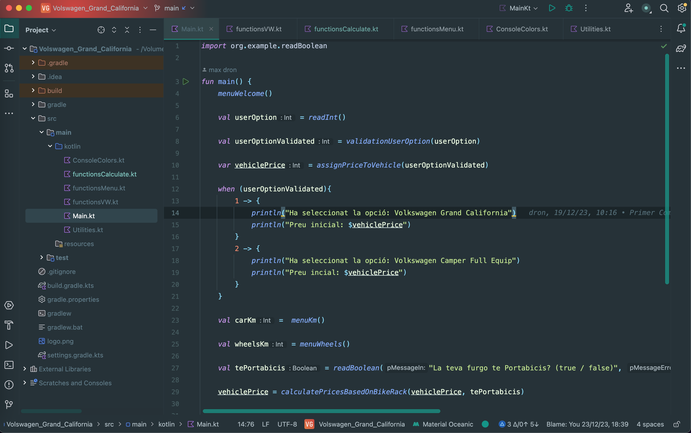
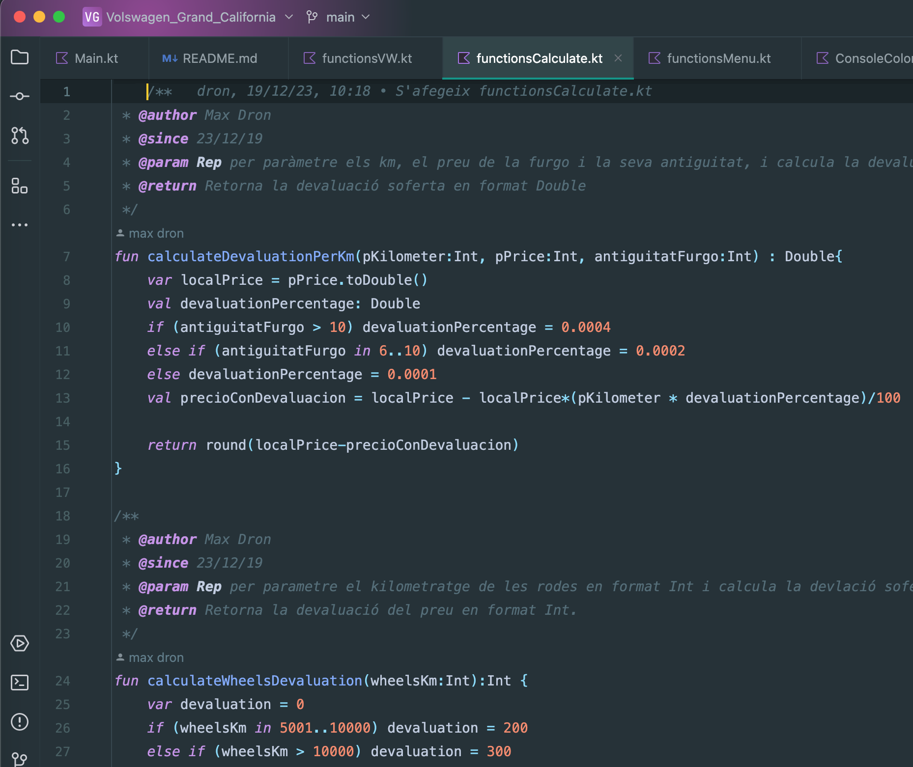
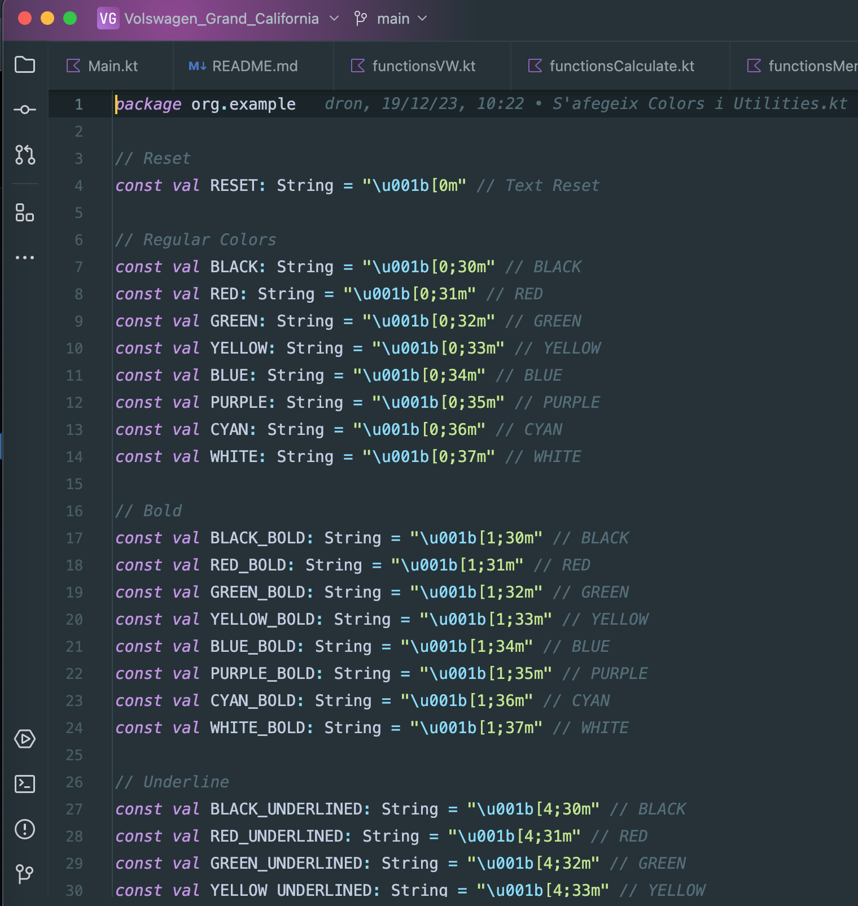
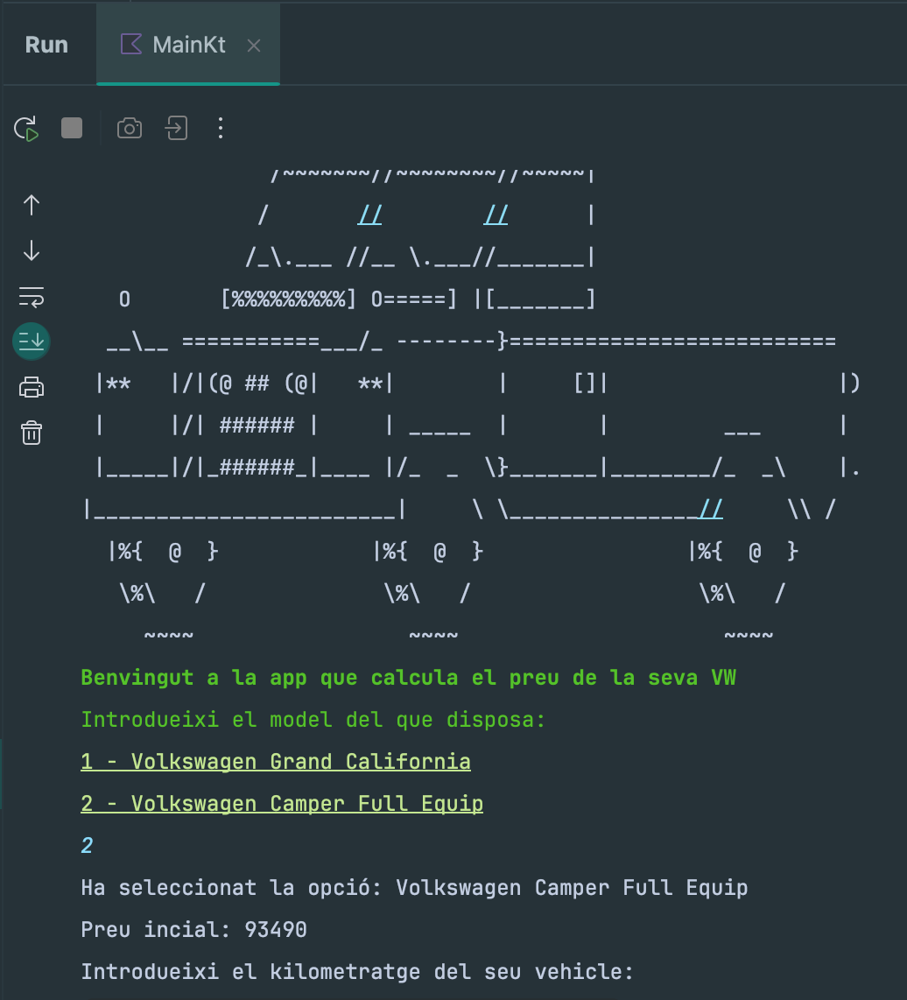
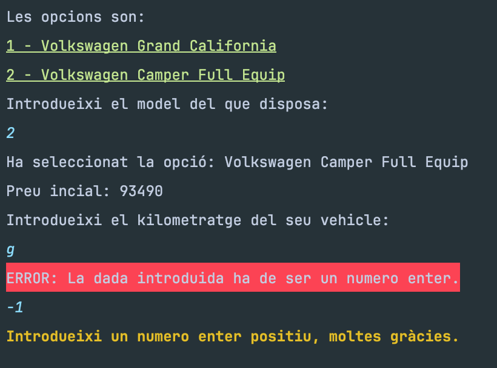
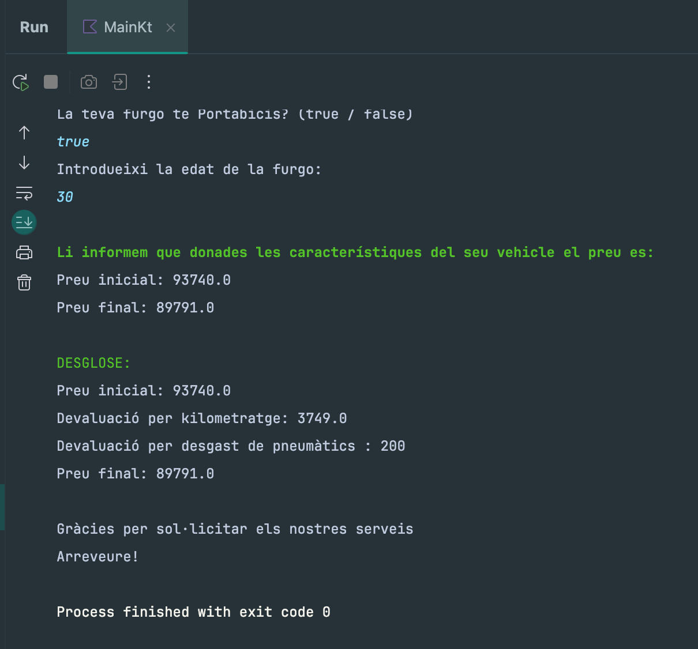

# PROJECT VOLKSWAGEN GRAND CALIFORNIA

# Overview
Volkswagen Grand California is an educational project based on Kotlin, aimed at practicing modular programming, code documentation, and becoming familiar with the GitHub environment, in the Catalan language.

# Project Description
This application assumes that you are a user of a Volkswagen Grand California and offers to calculate its price when you want to sell it as a used vehicle. The application utilizes various functions to determine the final price, such as the vehicle's mileage, tire wear, whether it has a bike rack, etc. In the end, the program will advise you on how much money it recommends listing it for in the used car market and provides a breakdown of the calculations performed.

The application relies on a file of functions to display various interaction [menus](/src/main/kotlin/functionsMenu.kt) with the user, a file for all functions related to [price calculation](/src/main/kotlin/functionsCalculate.kt), and another file with more [generic functions](/src/main/kotlin/functionsVW.kt) related to the purpose of the application. Additionally, two support files are included—one that provides quick and simple functions for [coloring](/src/main/kotlin/ConsoleColors.kt) console output, and another support file with [useful functions](/src/main/kotlin/Utilities.kt) for keyboard input, data validation, etc.

# Project Execution
Run the project and follow the on-screen instructions.

Don't worry if you enter the data incorrectly; the application has everything planned for that.

In the end, you will obtain the result of the function based on the inputs you provided to the application.

