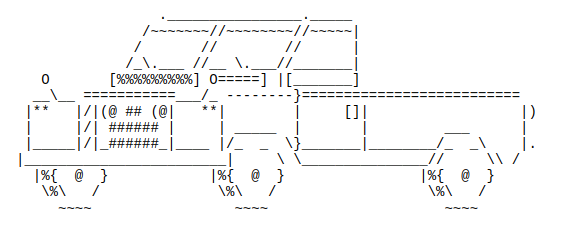

# PROJECT VOLKSWAGEN GRAND CALIFORNIA

# Overview
Volkswagen Grand California is an educational project based on Kotlin, aimed at practicing modular programming, code documentation, and becoming familiar with the GitHub environment, in the Catalan language.

# Project Description
This application assumes that you are a user of a Volkswagen Grand California and offers to calculate its price when you want to sell it as a used vehicle. The application utilizes various functions to determine the final price, such as the vehicle's mileage, tire wear, whether it has a bike rack, etc. In the end, the program will advise you on how much money it recommends listing it for in the used car market and provides a breakdown of the calculations performed.

The application relies on a file of functions to display various interaction [menus](src/main/kotlin/functionsMenu.kt) with the user, a file for all functions related to price calculation, and another file with more generic functions related to the purpose of the application. Additionally, two support files are included—one that provides quick and simple functions for coloring console output, and another support file with useful functions for keyboard input, data validation, etc.
